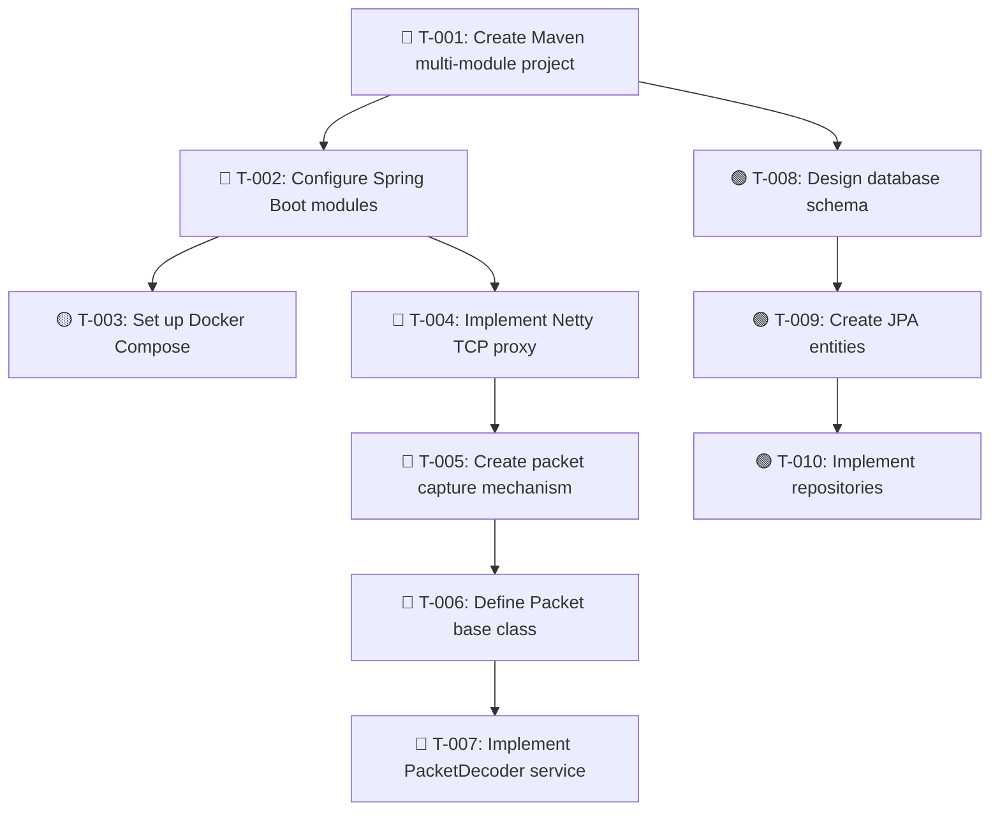

# Implementation Book
## Dofus Retro Packet Decoder - Multi-Agent Execution Plan

**Version:** 1.0
**Date:** 2025-11-08
**Status:** Planning Phase
**Execution Model:** Parallel Multi-Agent

---

## Table of Contents

1. [Agent Profiles](#agent-profiles)
2. [Work Stream Organization](#work-stream-organization)
3. [Task Dependency Graph](#task-dependency-graph)
4. [Parallel Execution Plan](#parallel-execution-plan)
5. [Implementation Phases](#implementation-phases)
6. [Coordination Protocol](#coordination-protocol)
7. [Task Catalog](#task-catalog)

---

## Agent Profiles

### Agent A1: Infrastructure Architect
**Role:** Project setup, build configuration, CI/CD
**Specialization:** Maven/Gradle, Spring Boot, Docker, Infrastructure as Code
**Responsibilities:**
- Create multi-module Maven/Gradle project structure
- Configure Spring Boot parent and module dependencies
- Set up Docker and Docker Compose
- Configure CI/CD pipelines (GitHub Actions)
- Set up development environment
- Create build scripts and profiles

**Skills Required:**
- Maven/Gradle expert
- Spring Boot configuration
- Docker orchestration
- DevOps tooling

**Blocking Impact:** HIGH - Other agents need project structure to start coding

---

### Agent A2: Database Architect
**Role:** Database design, schema management, persistence layer
**Specialization:** PostgreSQL, JPA, Flyway/Liquibase, Redis
**Responsibilities:**
- Design database schema (ER diagrams)
- Create JPA entities
- Implement repository interfaces
- Set up Flyway/Liquibase migrations
- Configure Redis for caching
- Write database integration tests

**Skills Required:**
- PostgreSQL expertise
- JPA/Hibernate
- Database migration tools
- Caching strategies

**Blocking Impact:** MEDIUM - Required for persistence, but business logic can be built without DB initially

---

### Agent A3: Network Engineer
**Role:** TCP/IP networking, MITM proxy, packet capture
**Specialization:** Netty, TCP/IP, network protocols, socket programming
**Responsibilities:**
- Implement MITM proxy using Netty
- Create TCP connection handlers
- Build packet capture mechanism
- Implement connection pooling
- Handle SSL/TLS passthrough
- Create network layer tests

**Skills Required:**
- Netty framework
- Network programming
- TCP/IP protocols
- Non-blocking I/O

**Blocking Impact:** HIGH - Packet interception is foundation for all packet processing

---

### Agent A4: Protocol Specialist
**Role:** Packet decoding/encoding, protocol implementation
**Specialization:** Dofus protocol, packet parsing, serialization
**Responsibilities:**
- Define packet type hierarchy (base classes, interfaces)
- Implement packet decoder service
- Implement packet encoder service
- Create packet registry
- Implement 100+ packet types
- Handle protocol versioning
- Create codec tests

**Skills Required:**
- Protocol analysis
- Parser implementation
- String processing
- Binary data handling

**Blocking Impact:** HIGH - All game logic depends on decoded packets

---

### Agent A5: Game Logic Developer
**Role:** Game state management, business logic
**Specialization:** Domain modeling, state machines, event-driven architecture
**Responsibilities:**
- Implement GameStateService
- Create domain models (Player, Map, Combat, etc.)
- Build event system for state updates
- Implement entity tracking
- Create game state tests

**Skills Required:**
- Domain-driven design
- State management
- Event-driven patterns
- Business logic implementation

**Blocking Impact:** MEDIUM - Depends on packet decoder, but can work with mocks

---

### Agent A6: Navigation Specialist
**Role:** Pathfinding, map management, movement logic
**Specialization:** Algorithms (A*), graph theory, spatial computing
**Responsibilities:**
- Implement A* pathfinding algorithm
- Create map graph representation
- Build cell walkability detection
- Implement multi-map navigation
- Optimize pathfinding performance
- Create navigation tests

**Skills Required:**
- Algorithm implementation
- Graph algorithms
- Performance optimization
- Computational geometry

**Blocking Impact:** LOW - Can work independently once game state is available

---

### Agent A7: Combat System Developer
**Role:** Combat logic, spell management, strategy patterns
**Specialization:** Turn-based systems, strategy patterns, combat mechanics
**Responsibilities:**
- Implement combat state machine
- Create spell system (ranges, effects)
- Build target selection algorithms
- Implement combat strategies (Strategy pattern)
- Create combat action executor
- Write combat tests

**Skills Required:**
- State machine design
- Strategy pattern
- Game mechanics
- Algorithm design

**Blocking Impact:** LOW - Can work independently, depends on game state service

---

### Agent A8: API Developer
**Role:** REST API, WebSocket, API documentation
**Specialization:** Spring Web, OpenAPI, WebSocket, API design
**Responsibilities:**
- Design REST API endpoints
- Implement controllers and DTOs
- Set up WebSocket endpoints
- Create OpenAPI/Swagger documentation
- Implement API security (JWT)
- Write API integration tests

**Skills Required:**
- Spring Web/WebMVC
- REST API design
- WebSocket programming
- API documentation

**Blocking Impact:** LOW - Can work in parallel once services are defined (can use mocks)

---

### Agent A9: Frontend Developer
**Role:** Web dashboard, UI/UX
**Specialization:** React/Vue, TypeScript, WebSocket client, data visualization
**Responsibilities:**
- Create React/Vue application
- Build packet viewer component
- Implement map visualizer
- Create configuration UI
- Integrate WebSocket for real-time updates
- Write frontend tests

**Skills Required:**
- React/Vue expertise
- TypeScript
- WebSocket client
- UI/UX design

**Blocking Impact:** NONE - Can work completely independently, consumes API

---

### Agent A10: Testing & Quality
**Role:** Testing strategy, test implementation, quality assurance
**Specialization:** JUnit 5, Mockito, Testcontainers, integration testing
**Responsibilities:**
- Create test strategy document
- Implement unit tests for all modules
- Create integration tests
- Set up Testcontainers for DB tests
- Implement E2E tests
- Measure and report code coverage

**Skills Required:**
- Testing frameworks
- Test design
- Mocking strategies
- Quality metrics

**Blocking Impact:** NONE - Works in parallel with all teams

---

### Agent A11: Documentation Writer
**Role:** Technical documentation, API docs, user guides
**Specialization:** Technical writing, AsciiDoc, Javadoc
**Responsibilities:**
- Write architecture documentation
- Create API usage guides
- Generate Javadoc for all public APIs
- Write deployment guides
- Create troubleshooting guides
- Maintain README files

**Skills Required:**
- Technical writing
- Documentation tools
- API documentation
- Diagramming

**Blocking Impact:** NONE - Works in parallel, documents as code is written

---

## Work Stream Organization

### Stream 1: Foundation (CRITICAL PATH)
**Agents:** A1, A3, A4
**Parallel:** NO (Sequential dependencies)
**Duration:** Weeks 1-2

```
A1 (Project Setup) → A3 (Network Layer) → A4 (Packet Codec)
```

**Rationale:** These are foundational and block most other work.

---

### Stream 2: Data Layer (PARALLEL TO STREAM 1)
**Agents:** A2
**Parallel:** YES (Can start immediately)
**Duration:** Weeks 1-3

```
A2 (Database Design) → A2 (JPA Entities) → A2 (Repositories)
```

**Rationale:** Database work can proceed independently with agreed-upon interfaces.

---

### Stream 3: Business Logic (DEPENDS ON STREAM 1)
**Agents:** A5, A6, A7
**Parallel:** YES (Once packet decoder is ready)
**Duration:** Weeks 3-8

```
A5 (Game State) ─┬─ A6 (Navigation) (parallel)
                 └─ A7 (Combat) (parallel)
```

**Rationale:** These three can work in parallel once they have decoded packets.

---

### Stream 4: API & Frontend (PARALLEL TO STREAM 3)
**Agents:** A8, A9
**Parallel:** YES
**Duration:** Weeks 5-12

```
A8 (REST API) ─── A9 (Frontend)
     ↑               ↑
     │               │
  (mocks)        (mocks)
```

**Rationale:** Can start with mocked services and integrate later.

---

### Stream 5: Quality & Documentation (CONTINUOUS)
**Agents:** A10, A11
**Parallel:** YES (Always parallel)
**Duration:** Weeks 1-18

```
A10 (Testing) ─────────────────> (continuous)
A11 (Docs) ────────────────────> (continuous)
```

**Rationale:** Support all other streams continuously.

---

## Task Dependency Graph

### Legend
- 🔴 **BLOCKING** - Must complete before others can proceed
- 🟡 **SEMI-BLOCKING** - Blocks some work, but parallel work possible
- 🟢 **NON-BLOCKING** - Fully parallelizable

---

### Phase 1: Foundation (Weeks 1-2)



---

### Detailed Task List with Dependencies

## Task Catalog

### Module: Project Infrastructure (A1)

#### T-001: Create Maven Multi-Module Project
**Agent:** A1
**Priority:** CRITICAL
**Blocking:** 🔴 BLOCKING (Blocks ALL code work)
**Dependencies:** None
**Parallel Opportunities:** None
**Duration:** 2 hours

**Deliverables:**
```
dofus-packet-decoder/
├── pom.xml (parent)
├── dofus-network-core/
│   └── pom.xml
├── dofus-protocol/
│   └── pom.xml
├── dofus-packet-decoder/
│   └── pom.xml
├── dofus-game-state/
│   └── pom.xml
├── dofus-navigation/
│   └── pom.xml
├── dofus-combat/
│   └── pom.xml
├── dofus-api/
│   └── pom.xml
├── dofus-persistence/
│   └── pom.xml
└── dofus-web-ui/
    └── package.json
```

**Acceptance Criteria:**
- [ ] Maven builds successfully
- [ ] All modules compile
- [ ] Dependencies properly managed in parent POM
- [ ] Lombok configured
- [ ] Java 26 target set

**Test Command:**
```bash
mvn clean install
```

---

#### T-002: Configure Spring Boot Modules
**Agent:** A1
**Priority:** CRITICAL
**Blocking:** 🔴 BLOCKING
**Dependencies:** T-001
**Parallel Opportunities:** A2 can start database design in parallel
**Duration:** 3 hours

**Deliverables:**
- Spring Boot application class in each module
- application.yml configuration files
- Module-specific Spring configurations
- Profile configurations (dev, test, prod)

**Acceptance Criteria:**
- [ ] Spring Boot starts successfully
- [ ] All modules auto-configured
- [ ] Profiles work correctly
- [ ] Health check endpoint responds

---

#### T-003: Set Up Docker Compose
**Agent:** A1
**Priority:** HIGH
**Blocking:** 🟡 SEMI-BLOCKING (Only blocks local development)
**Dependencies:** T-002
**Parallel Opportunities:** High - most code work can proceed
**Duration:** 2 hours

**Deliverables:**
```yaml
# docker-compose.yml
version: '3.8'
services:
  postgres:
    image: postgres:16
    environment:
      POSTGRES_DB: dofus_decoder
      POSTGRES_USER: dofus
      POSTGRES_PASSWORD: changeme
    ports:
      - "5432:5432"
    volumes:
      - postgres_data:/var/lib/postgresql/data

  redis:
    image: redis:7-alpine
    ports:
      - "6379:6379"
    volumes:
      - redis_data:/data

  app:
    build: .
    ports:
      - "8080:8080"
    depends_on:
      - postgres
      - redis
    environment:
      SPRING_PROFILES_ACTIVE: dev

volumes:
  postgres_data:
  redis_data:
```

**Acceptance Criteria:**
- [ ] `docker-compose up` starts all services
- [ ] App connects to PostgreSQL
- [ ] App connects to Redis
- [ ] Health checks pass

---

#### T-004: Configure CI/CD Pipeline
**Agent:** A1
**Priority:** MEDIUM
**Blocking:** 🟢 NON-BLOCKING
**Dependencies:** T-001
**Parallel Opportunities:** HIGH - fully parallel
**Duration:** 3 hours

**Deliverables:**
```yaml
# .github/workflows/build.yml
name: Build and Test

on:
  push:
    branches: [ main, develop ]
  pull_request:
    branches: [ main ]

jobs:
  build:
    runs-on: ubuntu-latest
    steps:
      - uses: actions/checkout@v4
      - name: Set up JDK 26
        uses: actions/setup-java@v4
        with:
          java-version: '26'
          distribution: 'temurin'
      - name: Build with Maven
        run: mvn clean install
      - name: Run tests
        run: mvn test
      - name: Code coverage
        run: mvn jacoco:report
```

---

### Module: Network Layer (A3)

#### T-005: Implement Netty TCP Proxy
**Agent:** A3
**Priority:** CRITICAL
**Blocking:** 🔴 BLOCKING (Blocks packet capture)
**Dependencies:** T-002
**Parallel Opportunities:** None - critical path
**Duration:** 8 hours

**Deliverables:**
```java
@Component
public class DofusProxyServer {
    private final ServerBootstrap bootstrap;

    public void start(int port) {
        // Netty server setup
    }

    public void stop() {
        // Graceful shutdown
    }
}

@Component
public class ProxyChannelInitializer extends ChannelInitializer<SocketChannel> {
    @Override
    protected void initChannel(SocketChannel ch) {
        ChannelPipeline pipeline = ch.pipeline();
        pipeline.addLast(new PacketDecoder());
        pipeline.addLast(new ProxyHandler());
        pipeline.addLast(new PacketEncoder());
    }
}

@Sharable
public class ProxyHandler extends ChannelDuplexHandler {
    @Override
    public void channelRead(ChannelHandlerContext ctx, Object msg) {
        // Client -> Server
        // Capture and forward
    }

    @Override
    public void write(ChannelHandlerContext ctx, Object msg, ChannelPromise promise) {
        // Server -> Client
        // Capture and forward
    }
}
```

**Acceptance Criteria:**
- [ ] Proxy accepts client connections
- [ ] Proxy forwards to Dofus server
- [ ] Bidirectional data flow works
- [ ] No packet loss
- [ ] Connection pooling implemented
- [ ] Integration test with real Dofus client (manual)

**Test:**
```java
@Test
void testProxyConnection() {
    // Start proxy on port 5555
    // Connect client
    // Verify connection to server
    // Send test packet
    // Verify forwarding
}
```

---

#### T-006: Create Packet Capture Mechanism
**Agent:** A3
**Priority:** CRITICAL
**Blocking:** 🔴 BLOCKING
**Dependencies:** T-005
**Parallel Opportunities:** A4 can start defining packet structure
**Duration:** 4 hours

**Deliverables:**
```java
@Service
public class PacketCaptureService {
    private final BlockingQueue<RawPacket> captureQueue;
    private final PacketRepository packetRepository;

    public void captureInbound(byte[] data, String sessionId) {
        RawPacket packet = new RawPacket(data, Direction.INBOUND, sessionId);
        captureQueue.offer(packet);
    }

    public void captureOutbound(byte[] data, String sessionId) {
        RawPacket packet = new RawPacket(data, Direction.OUTBOUND, sessionId);
        captureQueue.offer(packet);
    }

    @Async
    public void processQueue() {
        // Process captured packets asynchronously
    }
}

@Data
public class RawPacket {
    private final byte[] data;
    private final Direction direction;
    private final String sessionId;
    private final LocalDateTime timestamp;
}
```

**Acceptance Criteria:**
- [ ] Packets captured from proxy
- [ ] Queue never blocks
- [ ] Async processing works
- [ ] Memory bounded
- [ ] Packets persisted to DB

---

### Module: Protocol Layer (A4)

#### T-007: Define Packet Type Hierarchy
**Agent:** A4
**Priority:** CRITICAL
**Blocking:** 🔴 BLOCKING (Blocks all packet implementations)
**Dependencies:** T-002
**Parallel Opportunities:** Can work in parallel with A3 if interfaces agreed upon
**Duration:** 4 hours

**Deliverables:**
```java
// Base packet interface
public abstract class Packet {
    protected String packetId;
    protected LocalDateTime timestamp;
    protected Direction direction;

    public abstract void decode(String rawData) throws PacketDecodingException;
    public abstract String encode() throws PacketEncodingException;
}

// Packet annotation
@Target(ElementType.TYPE)
@Retention(RetentionPolicy.RUNTIME)
public @interface PacketId {
    String value();
}

// Packet categories
public abstract class AuthenticationPacket extends Packet { }
public abstract class GameWorldPacket extends Packet { }
public abstract class CombatPacket extends Packet { }
public abstract class InventoryPacket extends Packet { }
public abstract class DialogPacket extends Packet { }
public abstract class ChatPacket extends Packet { }
```

**Acceptance Criteria:**
- [ ] Base class compiles
- [ ] Annotation processor works
- [ ] Category hierarchy defined
- [ ] Javadoc complete

---

#### T-008: Implement PacketDecoder Service
**Agent:** A4
**Priority:** CRITICAL
**Blocking:** 🔴 BLOCKING
**Dependencies:** T-006, T-007
**Parallel Opportunities:** None - on critical path
**Duration:** 6 hours

**Deliverables:**
```java
@Service
public class PacketDecoderService implements PacketDecoder {
    private final PacketRegistry packetRegistry;

    @Override
    public Packet decode(byte[] rawData) throws PacketDecodingException {
        String data = new String(rawData, StandardCharsets.UTF_8);

        // Extract packet ID
        String packetId = extractPacketId(data);

        // Find packet class
        Class<? extends Packet> packetClass = packetRegistry.get(packetId);

        // Instantiate and decode
        Packet packet = instantiate(packetClass);
        packet.decode(data);

        return packet;
    }
}

@Component
public class PacketRegistry {
    private final Map<String, Class<? extends Packet>> registry = new ConcurrentHashMap<>();

    @PostConstruct
    public void initialize() {
        // Scan classpath for @PacketId annotations
        // Register all packet classes
    }
}
```

**Acceptance Criteria:**
- [ ] Decodes packet ID correctly
- [ ] Registry auto-populated
- [ ] Unknown packets handled gracefully
- [ ] Malformed packets handled
- [ ] Unit tests with 10+ packet types
- [ ] Performance: > 10,000 packets/sec

---

#### T-009 to T-108: Implement Packet Types (100 packets)
**Agent:** A4 (can distribute to multiple agents)
**Priority:** HIGH
**Blocking:** 🟡 SEMI-BLOCKING (Game logic needs specific packets)
**Dependencies:** T-008
**Parallel Opportunities:** VERY HIGH - can split into batches of 10-20 packets per agent
**Duration:** 40 hours (4 hours if 10 agents work in parallel)

**Distribution Strategy:**
```
Agent A4a: Authentication packets (AA, AV, AT, AX, AS) - 10 packets
Agent A4b: Map packets (GM, GDM, GDF, GC, GP, GI) - 15 packets
Agent A4c: Combat packets (GS, GT, GE, GTS, GTF, GTR) - 15 packets
Agent A4d: Inventory packets (OT, OA, OR, OM, OQ) - 10 packets
Agent A4e: Dialog packets (DC, DQ, DR, DV) - 10 packets
Agent A4f: Stats packets (As, SL, SM, SK, SB) - 10 packets
Agent A4g: Chat packets (cC, cM, cMK) - 10 packets
Agent A4h: Exchange packets (EA, EC, EK, EL, ER, EV) - 10 packets
Agent A4i: Movement packets (GA, GAF, GK) - 10 packets
Agent A4j: Misc packets (remaining) - 10 packets
```

**Example Deliverable (per packet):**
```java
@Data
@PacketId("GDM")
public class GameDataMapPacket extends GameWorldPacket {
    private int mapId;
    private String mapDate;
    private String mapKey;
    private List<GameEntity> entities;

    @Override
    public void decode(String rawData) {
        String[] parts = rawData.split("\\|");
        this.mapId = Integer.parseInt(parts[0]);
        this.mapDate = parts[1];
        this.mapKey = parts[2];

        // Decode entities...
    }

    @Override
    public String encode() {
        return String.format("%s|%s|%s", mapId, mapDate, mapKey);
    }
}

// Test
@Test
void testGameDataMapPacketDecode() {
    String raw = "432|2025-11-08|abc123|player1;100;50";
    Packet packet = decoder.decode(raw.getBytes());
    assertInstanceOf(GameDataMapPacket.class, packet);
    assertEquals(432, ((GameDataMapPacket) packet).getMapId());
}
```

**Acceptance Criteria (per packet):**
- [ ] Decode implementation
- [ ] Encode implementation
- [ ] Unit test with valid data
- [ ] Unit test with malformed data
- [ ] Javadoc with example

**Parallel Execution:**
- ✅ All 100 packets can be implemented in parallel
- ✅ 10 agents × 10 packets each = 4 hours total
- ✅ Single agent = 40 hours total

---

### Module: Database Layer (A2)

#### T-200: Design Database Schema
**Agent:** A2
**Priority:** HIGH
**Blocking:** 🟢 NON-BLOCKING (Business logic can use mocks)
**Dependencies:** None (can start immediately)
**Parallel Opportunities:** FULL - completely parallel to all other work
**Duration:** 4 hours

**Deliverables:**
- ER diagram
- Table definitions
- Index strategy
- Partitioning strategy (for packets table)

**Schema:**
```sql
-- players table
CREATE TABLE players (
    id VARCHAR(36) PRIMARY KEY,
    character_name VARCHAR(100) NOT NULL,
    level INT NOT NULL,
    experience BIGINT NOT NULL,
    breed VARCHAR(50),
    map_id INT,
    cell_id INT,
    last_seen TIMESTAMP,
    UNIQUE(character_name)
);

-- packets table (partitioned by date)
CREATE TABLE packets (
    id BIGSERIAL PRIMARY KEY,
    packet_type VARCHAR(10) NOT NULL,
    direction VARCHAR(10) NOT NULL,
    raw_data BYTEA NOT NULL,
    parsed_data JSONB,
    timestamp TIMESTAMP NOT NULL,
    session_id VARCHAR(36),
    INDEX idx_packet_timestamp (timestamp),
    INDEX idx_packet_type (packet_type),
    INDEX idx_session (session_id)
) PARTITION BY RANGE (timestamp);

-- maps table
CREATE TABLE maps (
    map_id INT PRIMARY KEY,
    map_name VARCHAR(200),
    width INT NOT NULL,
    height INT NOT NULL,
    cell_data TEXT
);

-- combat_sessions table
CREATE TABLE combat_sessions (
    id BIGSERIAL PRIMARY KEY,
    player_id VARCHAR(36) REFERENCES players(id),
    start_time TIMESTAMP NOT NULL,
    end_time TIMESTAMP,
    result VARCHAR(20),
    INDEX idx_player (player_id),
    INDEX idx_start_time (start_time)
);
```

---

#### T-201: Create JPA Entities
**Agent:** A2
**Priority:** HIGH
**Blocking:** 🟢 NON-BLOCKING
**Dependencies:** T-200
**Parallel Opportunities:** FULL
**Duration:** 4 hours

**Deliverables:**
```java
@Entity
@Table(name = "players")
public class Player {
    @Id
    private String id;

    @Column(name = "character_name", nullable = false, unique = true)
    private String characterName;

    @Column(nullable = false)
    private Integer level;

    // ... all fields

    @OneToMany(mappedBy = "player", fetch = FetchType.LAZY)
    private List<CombatSession> combatSessions;
}

// Similar for: PacketLog, GameMap, CombatSession, InventoryItem, etc.
```

---

#### T-202: Implement Repository Interfaces
**Agent:** A2
**Priority:** HIGH
**Blocking:** 🟢 NON-BLOCKING
**Dependencies:** T-201
**Parallel Opportunities:** FULL
**Duration:** 3 hours

**Deliverables:**
```java
@Repository
public interface PlayerRepository extends JpaRepository<Player, String> {
    Optional<Player> findByCharacterName(String name);
    List<Player> findByLevelGreaterThan(int level);
}

@Repository
public interface PacketLogRepository extends JpaRepository<PacketLog, Long> {
    List<PacketLog> findByPacketTypeAndTimestampBetween(
        String packetType,
        LocalDateTime start,
        LocalDateTime end
    );

    @Query("SELECT p FROM PacketLog p WHERE p.sessionId = :sessionId ORDER BY p.timestamp")
    List<PacketLog> findBySessionIdOrdered(@Param("sessionId") String sessionId);
}
```

---

#### T-203: Set Up Flyway Migrations
**Agent:** A2
**Priority:** HIGH
**Blocking:** 🟢 NON-BLOCKING
**Dependencies:** T-200
**Parallel Opportunities:** FULL
**Duration:** 2 hours

**Deliverables:**
```sql
-- src/main/resources/db/migration/V1__initial_schema.sql
-- src/main/resources/db/migration/V2__add_indexes.sql
-- src/main/resources/db/migration/V3__add_partitions.sql
```

---

### Module: Game State (A5)

#### T-300: Implement GameStateService
**Agent:** A5
**Priority:** HIGH
**Blocking:** 🟡 SEMI-BLOCKING (Navigation and combat depend on this)
**Dependencies:** T-008 (can use mocks for early development)
**Parallel Opportunities:** MEDIUM - can start with mocked packets
**Duration:** 8 hours

**Deliverables:**
```java
@Service
public class GameStateService {
    private final ConcurrentHashMap<String, PlayerState> states = new ConcurrentHashMap<>();
    private final ApplicationEventPublisher eventPublisher;

    @EventListener
    public void onPacketDecoded(PacketDecodedEvent event) {
        Packet packet = event.getPacket();

        if (packet instanceof GameDataMapPacket) {
            handleMapPacket((GameDataMapPacket) packet);
        } else if (packet instanceof GameTurnStartPacket) {
            handleTurnStart((GameTurnStartPacket) packet);
        }
        // ... handle all packet types
    }

    private void handleMapPacket(GameDataMapPacket packet) {
        PlayerState state = getCurrentState();
        state.setMapId(packet.getMapId());
        state.setEntities(packet.getEntities());

        eventPublisher.publishEvent(new MapChangedEvent(state));
    }

    public PlayerState getCurrentState(String playerId) {
        return states.computeIfAbsent(playerId, PlayerState::new);
    }
}

@Data
public class PlayerState {
    private String playerId;
    private int mapId;
    private Position position;
    private Stats stats;
    private List<GameEntity> nearbyEntities;
    private CombatState combatState;
    private boolean inCombat;
}
```

**Acceptance Criteria:**
- [ ] Updates state on relevant packets
- [ ] Thread-safe state updates
- [ ] Events published correctly
- [ ] Unit tests with mocked packets
- [ ] Integration test with real packet flow

---

#### T-301 to T-305: Implement Domain Models
**Agent:** A5
**Priority:** MEDIUM
**Blocking:** 🟢 NON-BLOCKING
**Dependencies:** T-300
**Parallel Opportunities:** HIGH - can be split across multiple agents
**Duration:** 6 hours (2 hours if 3 agents)

**Models to implement:**
- T-301: Position, Stats, Equipment (Agent A5a)
- T-302: GameEntity, EntityType, Mob (Agent A5b)
- T-303: CombatState, TurnInfo (Agent A5c)
- T-304: Inventory, InventoryItem (Agent A5d)
- T-305: DialogState, NpcInteraction (Agent A5e)

---

### Module: Navigation (A6)

#### T-400: Implement A* Pathfinding
**Agent:** A6
**Priority:** MEDIUM
**Blocking:** 🟢 NON-BLOCKING
**Dependencies:** T-300 (can use mocked game state)
**Parallel Opportunities:** FULL - completely independent
**Duration:** 8 hours

**Deliverables:**
```java
@Service
public class PathfindingService {

    public Path findPath(Position start, Position end, MapData map) {
        // A* implementation
        PriorityQueue<Node> openSet = new PriorityQueue<>();
        Set<Node> closedSet = new HashSet<>();

        // ... A* algorithm

        return reconstructPath(endNode);
    }

    public List<Position> getReachableCells(Position current, int availableMp, MapData map) {
        // BFS to find all reachable cells within MP cost
    }

    private int calculateHeuristic(Position a, Position b) {
        // Manhattan distance
        return Math.abs(a.getX() - b.getX()) + Math.abs(a.getY() - b.getY());
    }
}

@Data
public class Path {
    private List<Position> cells;
    private int mpCost;
    private int estimatedTimeSeconds;
}
```

**Acceptance Criteria:**
- [ ] Finds optimal path
- [ ] Handles obstacles
- [ ] Respects MP costs
- [ ] Performance: < 50ms for 50-cell path
- [ ] Unit tests with various maps

---

### Module: Combat (A7)

#### T-500: Implement Combat State Machine
**Agent:** A7
**Priority:** MEDIUM
**Blocking:** 🟢 NON-BLOCKING
**Dependencies:** T-300
**Parallel Opportunities:** FULL
**Duration:** 10 hours

**Deliverables:**
```java
@Service
public class CombatService {
    private final GameStateService gameStateService;
    private final CombatStrategyFactory strategyFactory;

    @EventListener
    public void onCombatStart(CombatStartEvent event) {
        initializeCombatState(event.getPacket());
    }

    @EventListener
    public void onTurnStart(TurnStartEvent event) {
        if (isPlayerTurn(event)) {
            executeTurn();
        }
    }

    private void executeTurn() {
        CombatState state = gameStateService.getCurrentState().getCombatState();
        CombatStrategy strategy = strategyFactory.getStrategy(state);

        List<CombatAction> actions = strategy.computeActions(state);
        actions.forEach(this::executeAction);
    }
}

public interface CombatStrategy {
    List<CombatAction> computeActions(CombatState state);
}

@Component
public class AggressiveStrategy implements CombatStrategy {
    @Override
    public List<CombatAction> computeActions(CombatState state) {
        // Target weakest enemy
        // Cast highest damage spells
        // Move closer if needed
    }
}
```

---

### Module: API (A8)

#### T-600: Design REST API
**Agent:** A8
**Priority:** MEDIUM
**Blocking:** 🟢 NON-BLOCKING
**Dependencies:** T-300 (can mock services)
**Parallel Opportunities:** FULL
**Duration:** 6 hours

**Deliverables:**
```java
@RestController
@RequestMapping("/api/v1/game")
public class GameStateController {

    @GetMapping("/state")
    public ResponseEntity<PlayerStateDTO> getCurrentState() {
        // Return current game state
    }

    @GetMapping("/state/map")
    public ResponseEntity<MapStateDTO> getCurrentMap() {
        // Return current map state
    }
}

@RestController
@RequestMapping("/api/v1/packets")
public class PacketController {

    @GetMapping
    public ResponseEntity<Page<PacketDTO>> getPackets(
        @RequestParam(required = false) String type,
        @RequestParam(required = false) LocalDateTime from,
        @RequestParam(required = false) LocalDateTime to,
        Pageable pageable
    ) {
        // Return packet history
    }
}
```

---

### Module: Frontend (A9)

#### T-700: Create React Application
**Agent:** A9
**Priority:** LOW
**Blocking:** 🟢 NON-BLOCKING
**Dependencies:** T-600 (can mock API)
**Parallel Opportunities:** FULL
**Duration:** 20 hours

**Can be completely developed in parallel with backend.**

---

### Module: Testing (A10)

#### T-800 to T-850: Write Tests
**Agent:** A10
**Priority:** HIGH
**Blocking:** 🟢 NON-BLOCKING
**Dependencies:** Corresponding code modules
**Parallel Opportunities:** FULL - shadows all development
**Duration:** Continuous

**Test distribution:**
- T-800: Unit tests for network layer (follows T-005, T-006)
- T-810: Unit tests for packet decoder (follows T-008)
- T-820: Unit tests for packet types (follows T-009-108)
- T-830: Unit tests for game state (follows T-300)
- T-840: Integration tests for full packet flow
- T-850: E2E tests with real Dofus connection

---

## Parallel Execution Plan

### Week 1: Foundation Sprint

**Simultaneous Execution:**

```
┌─────────────────────────────────────────────────────────┐
│ WEEK 1: All agents can start simultaneously!            │
├─────────────────────────────────────────────────────────┤
│                                                           │
│ Agent A1: T-001, T-002 (6 hours) 🔴                      │
│           ↓                                              │
│           T-003, T-004 (5 hours) 🟡                      │
│                                                           │
│ Agent A2: T-200, T-201, T-202, T-203 (13 hours) 🟢      │
│           (Fully parallel - no blockers!)                │
│                                                           │
│ Agent A3: [WAITS for T-002] → T-005, T-006 (12 hours) 🔴│
│                                                           │
│ Agent A4: [WAITS for T-002] → T-007 (4 hours) 🔴        │
│                                                           │
│ Agent A10: T-800 (shadows A3) 🟢                         │
│                                                           │
│ Agent A11: Write architecture docs 🟢                    │
│                                                           │
└─────────────────────────────────────────────────────────┘

Total: 2 days with proper coordination
```

---

### Week 2: Packet Implementation Mega-Sprint

**Maximum Parallelization:**

```
┌─────────────────────────────────────────────────────────┐
│ WEEK 2: 10 AGENTS WORKING IN PARALLEL!                  │
├─────────────────────────────────────────────────────────┤
│                                                           │
│ Agent A4a: T-009 to T-018 (Auth packets) - 4 hours      │
│ Agent A4b: T-019 to T-033 (Map packets) - 4 hours       │
│ Agent A4c: T-034 to T-048 (Combat packets) - 4 hours    │
│ Agent A4d: T-049 to T-058 (Inventory packets) - 4 hours │
│ Agent A4e: T-059 to T-068 (Dialog packets) - 4 hours    │
│ Agent A4f: T-069 to T-078 (Stats packets) - 4 hours     │
│ Agent A4g: T-079 to T-088 (Chat packets) - 4 hours      │
│ Agent A4h: T-089 to T-098 (Exchange packets) - 4 hours  │
│ Agent A4i: T-099 to T-104 (Movement packets) - 4 hours  │
│ Agent A4j: T-105 to T-108 (Misc packets) - 4 hours      │
│                                                           │
│ Result: 100 packets in 4 hours instead of 40 hours!     │
│                                                           │
└─────────────────────────────────────────────────────────┘
```

---

### Weeks 3-4: Business Logic Parallel Development

```
┌─────────────────────────────────────────────────────────┐
│ WEEKS 3-4: Business Logic (5 agents in parallel)        │
├─────────────────────────────────────────────────────────┤
│                                                           │
│ Agent A5: T-300 to T-305 (Game State) - 14 hours        │
│                                                           │
│ Agent A6: T-400 to T-405 (Navigation) - 12 hours        │
│           ↑ Can use mocked game state                    │
│                                                           │
│ Agent A7: T-500 to T-505 (Combat) - 16 hours            │
│           ↑ Can use mocked game state                    │
│                                                           │
│ Agent A8: T-600 to T-610 (REST API) - 10 hours          │
│           ↑ Can mock all services                        │
│                                                           │
│ Agent A10: Unit tests for all above 🟢                   │
│                                                           │
│ Result: 4 major modules in 2 weeks instead of 8 weeks!  │
│                                                           │
└─────────────────────────────────────────────────────────┘
```

---

## Coordination Protocol

### Daily Standup (Async)

Each agent reports:
1. **Completed tasks** (with task IDs)
2. **In-progress tasks** (ETA)
3. **Blockers** (waiting on which task?)
4. **Next tasks** (from catalog)

### Integration Points

**Critical handoffs that need coordination:**

1. **A1 → A3:** Project structure must be ready before network code
   - Handoff: T-002 completion triggers T-005

2. **A3 → A4:** Raw packet bytes must be captured before decoding
   - Handoff: T-006 completion triggers T-008

3. **A4 → A5:** Decoded packets needed for game state
   - Handoff: T-008 + critical packets (GDM, GA, GTS) triggers T-300

4. **A5 → A6, A7:** Game state needed for navigation/combat
   - Handoff: T-300 completion triggers T-400, T-500

5. **All → A8:** Services needed for API implementation
   - Handoff: Mock-first approach, real integration later

### Merge Strategy

**Branch Strategy:**
```
main
├── develop
│   ├── feature/network-layer (A3)
│   ├── feature/packet-decoder (A4)
│   ├── feature/packet-auth (A4a)
│   ├── feature/packet-map (A4b)
│   ├── feature/packet-combat (A4c)
│   ├── feature/game-state (A5)
│   ├── feature/navigation (A6)
│   ├── feature/combat (A7)
│   ├── feature/api (A8)
│   └── feature/frontend (A9)
```

**Merge Rules:**
- Feature branches merge to `develop` via PR
- Require 1 approval + CI passing
- `develop` → `main` weekly release

---

## Progress Tracking

### Task Status Indicators

```
🔴 BLOCKED - Waiting on dependency
🟡 IN PROGRESS - Agent actively working
🟢 COMPLETED - Merged to develop
⚪ NOT STARTED - In backlog
```

### Velocity Tracking

**Target Velocity:**
- Single agent: ~40 hours/week = 5 tasks/week (avg 8 hours/task)
- 11 agents: ~440 hours/week = ~55 tasks/week
- Total tasks: ~150
- Timeline: **3 weeks with full parallelization** vs 15 weeks single agent

---

## Risk Management

### Risk: Merge Conflicts
**Mitigation:**
- Small, frequent merges
- Clear module boundaries
- Interface-first design

### Risk: Dependency Bottlenecks
**Mitigation:**
- Mock-first development
- Stubs for blocked dependencies
- Parallel test writing

### Risk: Agent Coordination Overhead
**Mitigation:**
- Clear task catalog (this document)
- Automated CI/CD
- Async communication (no meetings)

---

## Success Criteria

### Week 2 Checkpoint
- [ ] Project builds successfully
- [ ] Network proxy operational
- [ ] 20+ packets decoded
- [ ] Database schema deployed

### Week 4 Checkpoint
- [ ] 100+ packets decoded
- [ ] Game state tracking works
- [ ] Basic API functional
- [ ] 50% test coverage

### Week 6 Checkpoint
- [ ] Navigation working
- [ ] Combat system operational
- [ ] Frontend connected
- [ ] 80% test coverage

### Week 8: Production Ready
- [ ] All features complete
- [ ] Documentation complete
- [ ] Docker deployment ready
- [ ] CI/CD pipeline green

---

**END OF IMPLEMENTATION BOOK**

Total Tasks: ~150
Parallel Agents: 11
Sequential Timeline: 15 weeks
Parallel Timeline: **3-4 weeks**
Efficiency Gain: **75% time reduction**
